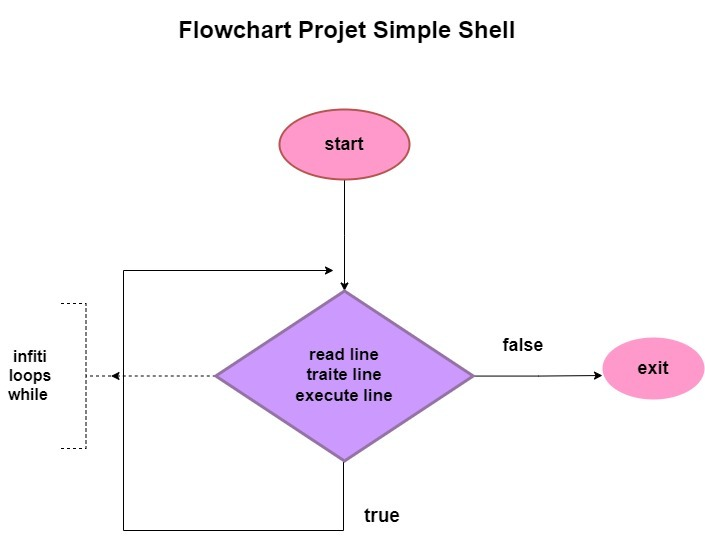

<h1 align="center">
	🔑 Simple Shell
</h1>

<p align="center">
	<b><i>HOLBERTON SCHOOL Simple Shell</i></b><br>
</p>

<p align="center">

</p>

<h3 align="center">
	<a href="#Description">Description</a>
	<span> · </span>
	<a href="#Algorithm-and-logic-behind-this">Algorithme</a>
	<span> · </span>
	<a href="#Compilation-and-testing">Testing</a>
</h3>

---

## 📋 Simple Shell:

 A simple UNIX command interpreter written as part of the low-level programming and algorithm.

## 🔍 Description: 

 is a simple UNIX command language interpreter that reads commands from either a file or standard input and executes them.


## 🎯  What our file stand for:


## 📇  SIMPLE_SHELL

## 🛠️  Algorithm and logic behind this
* Check this flowchart explaining the functions flow



*  For More Info About It Check The[man page](https://github.com/HanaOuerghemmi/holbertonschool-simple_shell/blob/main/man_1_simple_shell)


## 🔭  Compilation and testing

#### We are compiling via:
```
gcc -Wall -Werror -Wextra -pedantic -std=gnu89 *.c -o hsh
```
#### We are Testing via:

### EXEMPLE


## 🃏  Functions used:

* access
* chdir
* close
* closedir
* execve
* exit
* _exit
* fflush
* fork
* free
* getcwd
* getline
* getpid
* isatty
* kill
* malloc
* open
* opendir
* perror
* read
* readdir
* signal
* stat
* lstat
* fstat
* strtok
* wait
* waitpid
* wait3
* wait4
* write

##   What our file stand for:

## Authors:
* [Hana Ouerghemmi](https://github.com/HanaOuerghemmi)
* [ Majdi Aribi](https://github.com/majdideveloper)
* [Dhafer Hamza Sfaxi](https://github.com/dhaferHS) 
